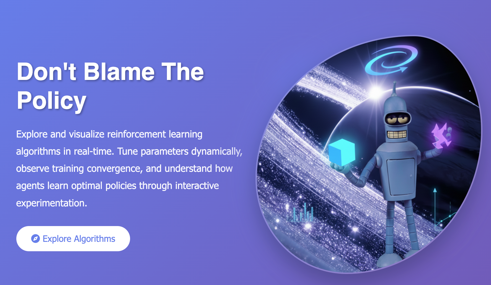

# Don't Blame The Policy 

##  Overview
**Don't Blame The Policy** is an interactive, web-based tool designed to help users **learn and visualize reinforcement learning (RL) algorithms** in real-time. The platform allows experimentation across multiple environments and RL algorithms, offering both a practical and educational experience for students, researchers, and enthusiasts.
<p align="center">
  
</p>

<p align="center"><em>Figure: The interactive UI of Don't Blame The Policy web app</em></p>

---

## Implemented Environments 

### 1. GridWorld
- Configurable grid size: 3×3 to 8×8  
- Random walls with adjustable density  
- Step-by-step agent visualization  
- **Rewards:** Goal +10, Step -0.1, Wall -1  

### 2. FrozenLake
- Configurable lake size: 4×4 to 8×8  
- Slippery surface option (33% chance of unintended movement)  
- Random hole generation with guaranteed solvable path  
- **Rewards:** Goal +10, Hole -10, Step -0.1  

### 3. CliffWalking
- Configurable environment: Small (4×12), Medium (5×15), Large (6×20)  
- Cliff region along the bottom edge  
- Agent resets to start on cliff fall  
- **Rewards:** Goal +10, Cliff -100, Step -1  

---

## Implemented Algorithms

**Dynamic Programming**
- Value Iteration  
- Policy Iteration  

**Model-Free RL**
- Q-Learning (Off-policy)  
- SARSA (On-policy)  
- Monte Carlo Methods (First-visit MC)  

**Temporal Difference Learning**
- General TD Learning  
- N-step TD  

**Features:**

- Supports epsilon-greedy exploration, learning rate (α), discount factor (γ)  
- Parameter adjustment for environment and algorithm behavior  

---

## Parameter Adjustment

**Algorithm Parameters:**  
Learning Rate (0.01–1.0), Discount Factor (0.5–0.999), Exploration Rate (0.01–0.5), Episodes (100–5000)  

**Environment Parameters:**
- **GridWorld:** Grid Size, Random Walls 
- **FrozenLake:** Lake Size, Slippery Surface On/Off, Hole Probability 0.1–0.3  
- **CliffWalking:** Environment Size  

---

##  Visualization Features

1. **Real-Time Training Visualization**  
   - Reward trends, convergence charts, algorithm-specific metrics  

2. **Environment Visualization**  
   - Grid representation, agent animation, color-coded cell types  

3. **Learned Policy Visualization**  
   - Action arrows (↑↓←→) showing optimal actions  
   - Value function heatmap  

4. **Value Function Visualization**  
   - Numerical display per state  
   - Color gradient legend  

---


## Setup & Usage

1. **Clone the repository:**
```bash
git clone https://github.com/ranazsaad/Donot-Blame-The-Policy.git
cd Donot-Blame-The-Policy
```

2. **Install dependencies:**
```bash
pip install -r requirements.txt
```

3. **Run the Flask application:**
```bash
python app.py
```

4. **Open in your browser:**
Go to `http://127.0.0.1:5000` to start exploring the RL environments interactively.

---

##  Features You Can Explore

- **Select RL algorithms:** Q-Learning, SARSA, TD, N-step TD, Monte Carlo, Value Iteration, Policy Iteration.  
- **Adjust parameters in real-time:** learning rate, discount factor, exploration rate, number of episodes.  
- **Visualize training:** live reward curves, value function heatmaps, policy arrows.  
- **Interactive environments:** move the agent, observe cliffs, slippery tiles, random walls.  

---

## Future Work

- **Custom environments** will let users design grids, obstacles, and rewards.  
- **Quantum RL integration** will explore hybrid quantum-classical algorithms with Qiskit.  
- **Advanced visualizations** will show 3D heatmaps, animated paths, and live policy updates.  
